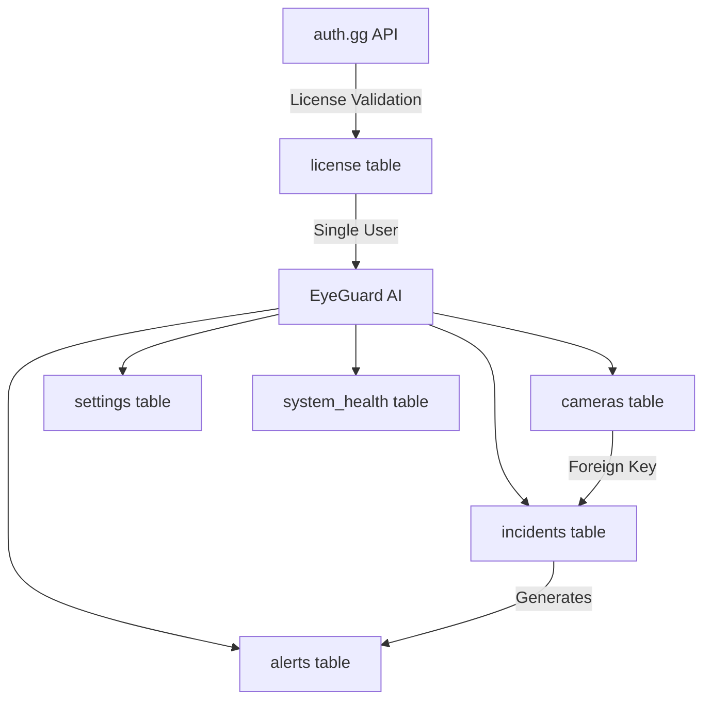
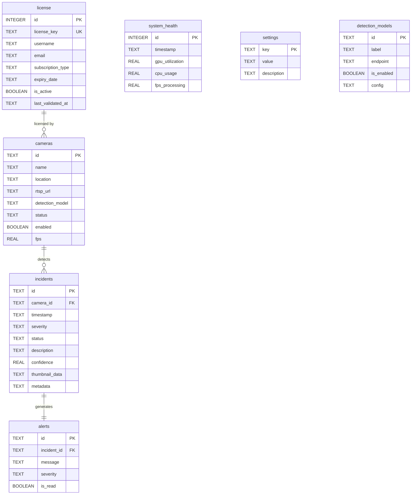
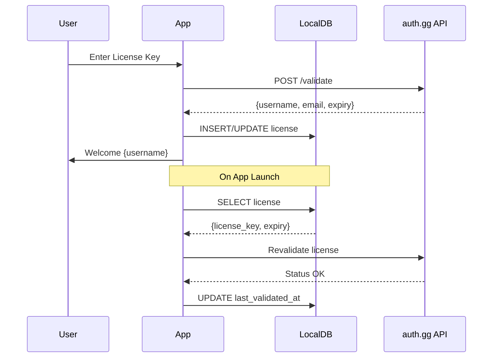

# EyeGuard AI Database Schema Design

## Architecture Overview

**Database Engine**: SQLite (perfect for local desktop Electron apps)  
**Location**: User's local system (`%APPDATA%/EyeGuard AI/database.db` on Windows)  
**Model**: Hybrid - license validation via auth.gg API, operational data stored locally




## Database Schema

### 1. License & User Table

Stores the licensed user's info fetched from auth.gg after license key validation.

```sql
CREATE TABLE license (
  id INTEGER PRIMARY KEY CHECK (id = 1), -- Enforce single row
  license_key TEXT NOT NULL UNIQUE,
  username TEXT NOT NULL,
  email TEXT,
  subscription_type TEXT, -- e.g., "premium", "basic", "trial"
  expiry_date TEXT, -- ISO 8601 timestamp
  is_active BOOLEAN DEFAULT 1,
  last_validated_at TEXT, -- ISO 8601 timestamp
  created_at TEXT DEFAULT (datetime('now')),
  updated_at TEXT DEFAULT (datetime('now'))
);
```

**Notes:**

- Single row enforced (one license per installation)
- `license_key` synced with auth.gg
- `last_validated_at` updated on app launch to verify license status

---

### 2. Cameras Table

Stores camera configurations and current status.

```sql
CREATE TABLE cameras (
  id TEXT PRIMARY KEY, -- UUID
  name TEXT NOT NULL,
  location TEXT NOT NULL,
  rtsp_url TEXT NOT NULL,
  detection_model TEXT NOT NULL, -- "theft-detection", "intrusion-detection", etc.
  status TEXT DEFAULT 'inactive', -- "active", "inactive", "error"
  enabled BOOLEAN DEFAULT 1,
  fps REAL DEFAULT 0,
  last_frame_timestamp TEXT, -- ISO 8601
  error_message TEXT, -- Store last error if status = "error"
  created_at TEXT DEFAULT (datetime('now')),
  updated_at TEXT DEFAULT (datetime('now')),
  CHECK (status IN ('active', 'inactive', 'error')),
  CHECK (detection_model IN (
    'theft-detection',
    'intrusion-detection', 
    'loitering-detection',
    'violence-detection',
    'fire-smoke-detection',
    'crowd-analysis'
  ))
);

CREATE INDEX idx_cameras_status ON cameras(status);
CREATE INDEX idx_cameras_enabled ON cameras(enabled);
```

**Key fields:**

- `rtsp_url`: Camera stream URL (e.g., `rtsp://192.168.1.100:554/stream`)
- `detection_model`: Which AI model to use for this camera
- `enabled`: Allows admin to temporarily disable without deleting

---

### 3. Incidents Table

Stores all detected theft/suspicious events with thumbnails.

```sql
CREATE TABLE incidents (
  id TEXT PRIMARY KEY, -- UUID
  camera_id TEXT NOT NULL,
  timestamp TEXT NOT NULL, -- ISO 8601
  severity TEXT NOT NULL, -- "critical", "warning", "info"
  status TEXT DEFAULT 'pending', -- "pending", "reviewed", "dismissed"
  description TEXT NOT NULL,
  confidence REAL NOT NULL, -- 0.0 to 1.0 (e.g., 0.87 = 87% confidence)
  thumbnail_data TEXT, -- Base64-encoded image data
  metadata TEXT, -- JSON string for additional detection data
  reviewed_at TEXT, -- ISO 8601
  dismissed_at TEXT, -- ISO 8601
  created_at TEXT DEFAULT (datetime('now')),
  FOREIGN KEY (camera_id) REFERENCES cameras(id) ON DELETE CASCADE,
  CHECK (severity IN ('critical', 'warning', 'info')),
  CHECK (status IN ('pending', 'reviewed', 'dismissed')),
  CHECK (confidence >= 0.0 AND confidence <= 1.0)
);

CREATE INDEX idx_incidents_camera ON incidents(camera_id);
CREATE INDEX idx_incidents_timestamp ON incidents(timestamp DESC);
CREATE INDEX idx_incidents_severity ON incidents(severity);
CREATE INDEX idx_incidents_status ON incidents(status);
CREATE INDEX idx_incidents_search ON incidents(timestamp DESC, severity, status);
```

**Key fields:**

- `thumbnail_data`: Base64-encoded PNG/JPEG snapshot (recommended max 200KB)
- `metadata`: JSON with bounding boxes, object classes, etc.
- `confidence`: AI detection confidence score

---

### 4. Alerts Table

Stores real-time alerts generated from incidents.

```sql
CREATE TABLE alerts (
  id TEXT PRIMARY KEY, -- UUID
  incident_id TEXT NOT NULL,
  message TEXT NOT NULL,
  severity TEXT NOT NULL, -- "critical", "warning", "info"
  is_read BOOLEAN DEFAULT 0,
  created_at TEXT DEFAULT (datetime('now')),
  FOREIGN KEY (incident_id) REFERENCES incidents(id) ON DELETE CASCADE,
  CHECK (severity IN ('critical', 'warning', 'info'))
);

CREATE INDEX idx_alerts_unread ON alerts(is_read, created_at DESC);
CREATE INDEX idx_alerts_severity ON alerts(severity);
```

**Notes:**

- One alert per incident (created when incident is first detected)
- `is_read` tracks if user has seen the alert in UI

---

### 5. System Health Metrics Table

Tracks system performance over time for graphs and monitoring.

```sql
CREATE TABLE system_health (
  id INTEGER PRIMARY KEY AUTOINCREMENT,
  timestamp TEXT NOT NULL, -- ISO 8601
  gpu_utilization REAL, -- 0-100
  cpu_usage REAL, -- 0-100
  memory_usage REAL, -- 0-100
  fps_processing REAL,
  detection_accuracy REAL, -- 0-100
  active_cameras INTEGER DEFAULT 0,
  created_at TEXT DEFAULT (datetime('now'))
);

CREATE INDEX idx_system_health_timestamp ON system_health(timestamp DESC);
```

**Usage:**

- Sample every 5-30 seconds during operation
- Use for dashboard charts (GPU usage over time, FPS trends, etc.)
- Consider retention policy (e.g., keep detailed data for 7 days, hourly aggregates for 90 days)

---

### 6. Settings Table

Key-value store for app configuration and user preferences.

```sql
CREATE TABLE settings (
  key TEXT PRIMARY KEY,
  value TEXT NOT NULL,
  description TEXT,
  updated_at TEXT DEFAULT (datetime('now'))
);

-- Default settings
INSERT INTO settings (key, value, description) VALUES
  ('theme', 'dark', 'UI theme: dark or light'),
  ('notification_sound', 'true', 'Play sound on critical alerts'),
  ('auto_start', 'false', 'Launch on system startup'),
  ('detection_sensitivity', 'medium', 'AI detection sensitivity: low, medium, high'),
  ('alert_cooldown', '300', 'Seconds between alerts for same camera'),
  ('max_fps_per_camera', '15', 'Max FPS to process per camera'),
  ('retention_days', '-1', 'Incident retention (-1 = forever)');
```

---

### 7. Detection Models Configuration Table

Stores available AI models and their configurations.

```sql
CREATE TABLE detection_models (
  id TEXT PRIMARY KEY,
  label TEXT NOT NULL,
  endpoint TEXT, -- For future API integration
  is_enabled BOOLEAN DEFAULT 1,
  config TEXT, -- JSON config (thresholds, classes, etc.)
  created_at TEXT DEFAULT (datetime('now')),
  updated_at TEXT DEFAULT (datetime('now'))
);

-- Seed data
INSERT INTO detection_models (id, label, endpoint, config) VALUES
  ('theft-detection', 'Theft Detection (YOLOv8)', '/api/detect/theft', '{"threshold": 0.7}'),
  ('intrusion-detection', 'Intrusion Detection', '/api/detect/intrusion', '{"threshold": 0.75}'),
  ('loitering-detection', 'Loitering Detection', '/api/detect/loitering', '{"threshold": 0.6, "duration": 30}'),
  ('violence-detection', 'Violence Detection', '/api/detect/violence', '{"threshold": 0.8}'),
  ('fire-smoke-detection', 'Fire & Smoke Detection', '/api/detect/fire', '{"threshold": 0.85}'),
  ('crowd-analysis', 'Crowd Analysis', '/api/detect/crowd', '{"threshold": 0.65, "max_people": 50}');
```

---

## Entity Relationship Diagram




---

## Implementation Recommendations

### Database Library

Use `**better-sqlite3**` for Electron:

```bash
npm install better-sqlite3 @types/better-sqlite3
```

**Why?**

- Synchronous API (simpler than async sqlite3)
- Faster performance
- Works well with Electron's main process

### File Structure

```
src/
  db/
    schema.ts          # Database initialization & migrations
    queries.ts         # SQL query functions
    models.ts          # TypeScript interfaces matching schema
  services/
    licenseService.ts  # auth.gg integration
    cameraService.ts   # Camera CRUD operations
    incidentService.ts # Incident management
```

### Migration Strategy

Create `[src/db/schema.ts](src/db/schema.ts)` with:

1. `initDatabase()` - Creates all tables if not exists
2. `runMigrations()` - Version-based schema updates
3. Store schema version in `settings` table

### Data Migration from Mock Data

Convert current mock data in `[src/data/mockData.ts](src/data/mockData.ts)` into seed data for testing:

- 28 cameras → `INSERT INTO cameras`
- 50 incidents → `INSERT INTO incidents`
- Detection models → Already in schema

---

## Integration with auth.gg

### License Validation Flow




### API Integration Points

In `[src/services/licenseService.ts](src/services/licenseService.ts)`:

- `validateLicenseKey(key: string)` - Calls auth.gg API
- `getLicense()` - Returns local license data
- `revalidateLicense()` - Background check on app launch

---

## Sample TypeScript Interfaces

```typescript
// src/db/models.ts
export interface License {
  id: number;
  license_key: string;
  username: string;
  email?: string;
  subscription_type?: string;
  expiry_date?: string;
  is_active: boolean;
  last_validated_at?: string;
  created_at: string;
  updated_at: string;
}

export interface Camera {
  id: string;
  name: string;
  location: string;
  rtsp_url: string;
  detection_model: DetectionModelType;
  status: 'active' | 'inactive' | 'error';
  enabled: boolean;
  fps: number;
  last_frame_timestamp?: string;
  error_message?: string;
  created_at: string;
  updated_at: string;
}

export type DetectionModelType =
  | 'theft-detection'
  | 'intrusion-detection'
  | 'loitering-detection'
  | 'violence-detection'
  | 'fire-smoke-detection'
  | 'crowd-analysis';

export interface Incident {
  id: string;
  camera_id: string;
  timestamp: string;
  severity: 'critical' | 'warning' | 'info';
  status: 'pending' | 'reviewed' | 'dismissed';
  description: string;
  confidence: number;
  thumbnail_data?: string;
  metadata?: string; // JSON
  reviewed_at?: string;
  dismissed_at?: string;
  created_at: string;
}

export interface Alert {
  id: string;
  incident_id: string;
  message: string;
  severity: 'critical' | 'warning' | 'info';
  is_read: boolean;
  created_at: string;
}

export interface SystemHealth {
  id: number;
  timestamp: string;
  gpu_utilization?: number;
  cpu_usage?: number;
  memory_usage?: number;
  fps_processing?: number;
  detection_accuracy?: number;
  active_cameras: number;
  created_at: string;
}

export interface Setting {
  key: string;
  value: string;
  description?: string;
  updated_at: string;
}

export interface DetectionModel {
  id: string;
  label: string;
  endpoint?: string;
  is_enabled: boolean;
  config?: string; // JSON
  created_at: string;
  updated_at: string;
}
```

---

## Security Considerations

1. **Database Encryption**: Consider using SQLCipher for encrypted SQLite database
2. **License Key Storage**: Never log or expose license key in plaintext
3. **RTSP Credentials**: If RTSP URLs contain passwords, encrypt them
4. **Thumbnail Size Limits**: Cap base64 thumbnails at 200KB to prevent bloat
5. **SQL Injection**: Use parameterized queries (better-sqlite3 does this by default)

---

## Performance Optimizations

1. **Indexes**: Already included on high-query columns (camera_id, timestamp, severity, status)
2. **Batch Inserts**: Use transactions for bulk incident inserts
3. **Thumbnail Compression**: Use JPEG with 70-80% quality before base64 encoding
4. **System Health Retention**: Implement cleanup job (keep raw data 7 days, aggregates 90 days)
5. **WAL Mode**: Enable Write-Ahead Logging for better concurrency

```typescript
// Enable WAL mode in schema.ts
db.pragma('journal_mode = WAL');
db.pragma('synchronous = NORMAL');
```

---

## Next Steps After Schema Approval

1. Create database initialization module (`[src/db/schema.ts](src/db/schema.ts)`)
2. Implement service layer (CRUD operations)
3. Replace mock data imports with database queries
4. Add auth.gg license validation service
5. Implement background tasks (health monitoring, license revalidation)
6. Add database migration system for future schema updates
7. Set up automated backups to user's Documents folder

